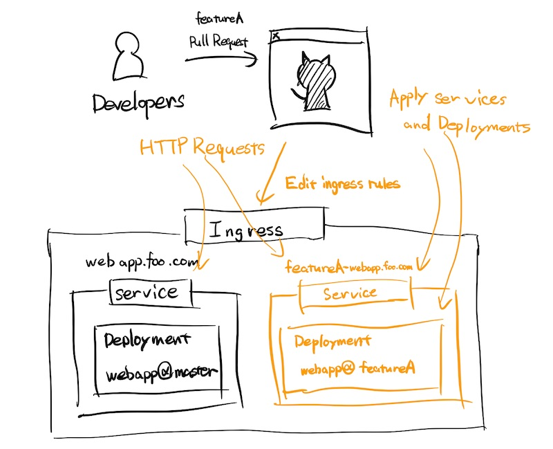

# github-actions-ingress-rules-editor

Edit kubernetes ingress rules and apply it.
This action is useful to build feature environments automatically on Github Actions.

## Scenario



This tool to help editing ingress rules in following architecture.
You need to create Deployments and Services on your Kubernetes cluster.
If you are using GKE, check https://github.com/c-bata/gcloud/tree/master/kubectl to apply.

## Command line tool

```
$ ./ingress_rules_editor --help
Usage:
  ./ingress_rules_editor -ingress=<INGRESS_NAME> -host=<INGRESS_HOST> -service=<SERVICE_NAME> -port=<SERVICE_PORT> add
  ./ingress_rules_editor -ingress=<INGRESS_NAME> -host=<INGRESS_HOST> remove

Options:
  -host string
        ingress host (required).
  -ingress string
        name of kubernetes ingress (required).
  -namespace string
        kubernetes namespace (optional).
  -path string
        matching path rules of an incoming request (optional). (default "/*")
  -port int
        port number (required when running 'add'). (default -1)
  -service string
        name of kubernetes service (required when running 'add').
  -y    say yes in all confirmations
```

## LICENSE

This software is licensed under the MIT license, see [LICENSE](./LICENSE) for more information.
